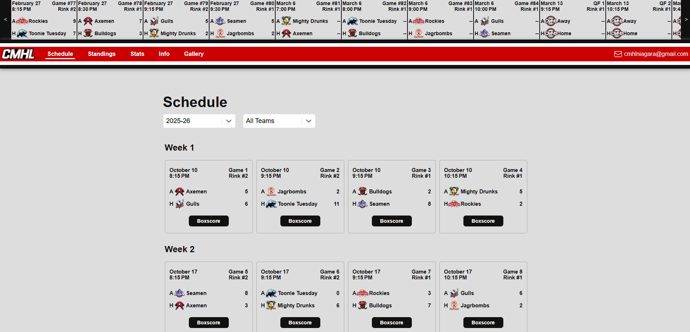
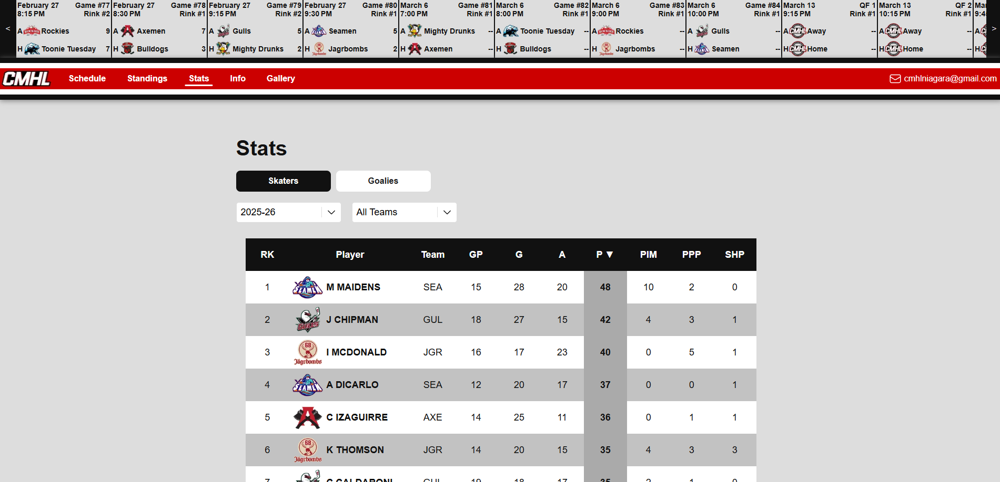
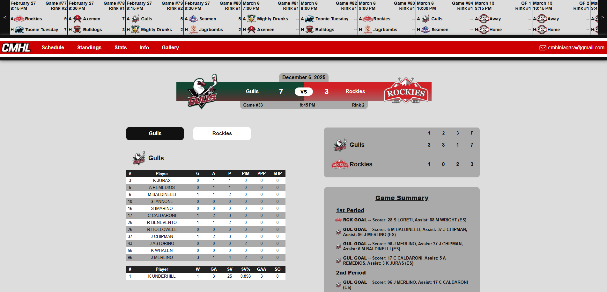

# Canucks Men's Hockey League (CMHL)

The Canucks Men's Hockey League (CMHL) is a men's recreational hockey league based in Niagara Falls, ON. This website provides players and fans with a central hub for league information including schedules, statistics, and updates.

## Live Site

https://cmhlniagara.com/

## Project Overview

The CMHL is a recreational men's hockey league played on Friday nights during the winter at the Gale Centre in Niagara Falls. The league required a centralized platform where players could easily access schedules, standings, and game information. Game times, dates, and rink assignments frequently change throughout the season. The website provides a reliable place where players, coaches, and fans can check the latest schedule information. Players, coaches, and fans can check out when each team is playing, on what day, and on which rink through this hub.

In addition to gameday information, the league keeps track of player and game statistics via video replay stats counting. Abstractly, after compiling player game stats, the stats counter will input the data into a Google Sheets Spreadsheet. That data is organized by the co-commissioner of the league and inputted into a structured sheet that the codebase fetches data from via Google Sheets API. This data is then translated cleanly to the front-end.

## Tech Stack

- Next.js
- React
- JavaScript
- CSS (Vanilla)
- Google Sheets API
- Vercel (Deployment)

## Key Features

- Responsive design using media queries and a windowWidth context provider.
- Schedule data cached using React Context provider to reduce API calls and improve performance.
- League data managed through Google Sheets and retrieved via the Google Sheets API.
- Dynamic data updates without requiring code changes.
- Environment variables stored in a .env file not saved in the codebase or exposed on GitHub.
- Dynamic routing for web pages using season (year) and a game number to formulate a path.

## Architecture Decisions

- Initially hosted on GitHub Pages and did not use the Next.js framework before the client requested dynamic updating and game-by-game player statistics.
- Used Next.js App Router for modern routing patterns.
- Google Sheets was chosen as the data source because the league commissioner was already comfortable managing spreadsheets. This allowed league data to be updated without requiring direct access to the codebase.
- Dynamic routing was required to avoid hard-coding a new page for every game's player statistics.
- Used a Server/Client split where the server is responsible for fetching and passing data down to the client as props. Client is not exposed to fetch logic and is strictly responsible for UI rendering and interactivity.

## Folder Structure

- /app for pages, providers, and global styles.
- /components for reusable UI components.
- /contexts for shared UI state used across the component tree. windowWidthContext tracks the browser width to drive responsiveness, and menuContext manages the mobile navigation toggle state.
- /utils for reusable functions like invoking an API call or formatting data.
- /public for static assets (images).

## Technical Decisions

This project was the first full website I built, so I chose React, which was (and still is) one of the most widely used libraries for modern web development.

At the time, I had limited experience with JavaScript and CSS, having only built small experimental projects while learning the basics. Because my primary goal was to learn React and component-based development, I chose vanilla CSS for styling rather than introducing additional abstractions such as CSS frameworks or libraries.

The project has gone through several architectural changes as the league grew. Initially, the site was hosted on GitHub Pages and consisted entirely of static content. Schedules and standings were manually hard-coded into the codebase. As the league expanded and the commissioners requested new features such as live score updates and player statistics, a static hosting solution became limiting. The project was therefore migrated to Vercel, allowing for server-side capabilities and dynamic data handling.

The league’s co-commissioner was highly proficient with spreadsheets (primarily Microsoft Excel). To allow him to manage updates independently and remove the need for me to manually edit data, I integrated the Google Sheets API. This allows standings, scores, and other league data to be updated directly through spreadsheets while automatically syncing with the site.

As the site evolved, a requirement emerged to display individual game pages with player statistics. Maintaining separate static pages for each game would have been unsustainable, so the project was migrated to Next.js to take advantage of its dynamic routing system. Each game page is generated using a unique ID based on the season year and game number.

## Challenges and Solutions

The biggest challenge in this project was learning React’s component-based architecture, which differs significantly from the procedural and iterative programming styles common in languages such as Python and Java, which I had primarily used in university.

Beyond simply delivering a product for the league, this project became a hands-on way for me to understand modern web development concepts such as:

- Component-based UI design
- State management
- Async data fetching
- Integrating external APIs

As development progressed and new feature requests emerged, the architecture of the project evolved several times, forcing me to adapt and refactor parts of the codebase while keeping the site stable for league use.

## What I Learned

- Basics of web development
- State management using tools such as useState, useEffect, and useContext
- Hosting and deployment basics
- Data fetching via external APIs

## Screenshots

### Schedule Page

### Stats Page

### Boxscore Page

